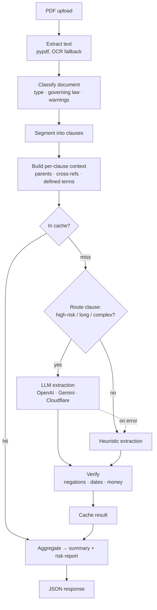
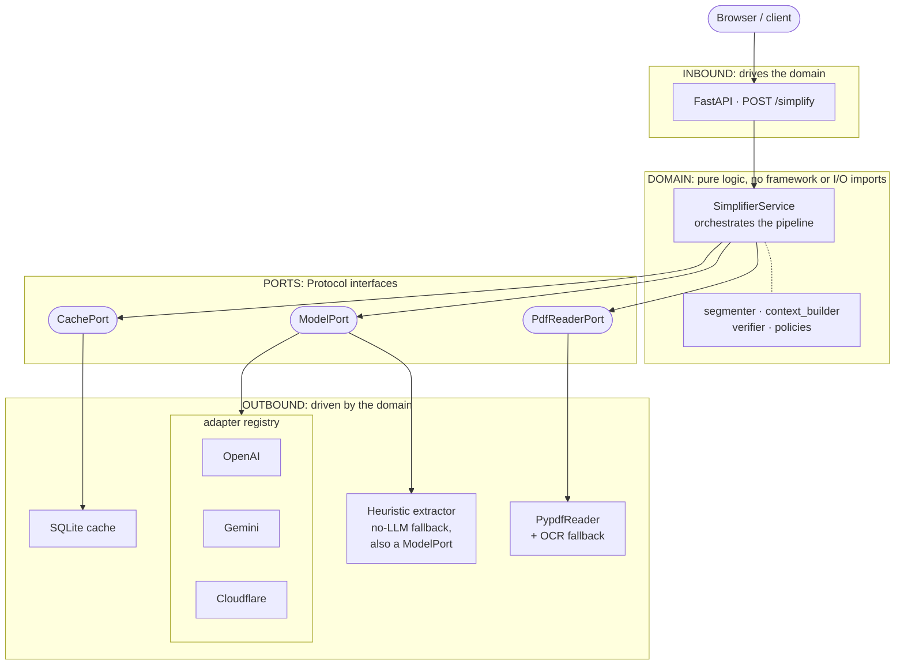

# Understand-IT

Some of the most consequential text in an ordinary life is written in language most people can't read. A lease. An employment contract. A loan agreement. That isn't an accident of style: legal writing optimizes for precision in a courtroom, not for the person holding the pen. The result is a quiet unfairness. Understanding what you're agreeing to costs money, and people who don't have it sign anyway.

Understand-IT is my attempt at that problem. It reads a legal document and explains it clause by clause in plain English: what each clause means, how risky it is, and what it commits you to pay or do. A professional gets a first-pass review in seconds instead of an hour. Someone who was never going to hire a lawyer gets to know what they signed. The knowledge in the document stops being gated by the language it's written in.

And the gap is wider than money. People are locked out of these documents for all kinds of reasons: they read English as a second language, they process dense text differently, they never learned the legal vocabulary because almost nobody does. The information in a contract belongs to the person signing it. This app's job is to hand it over. It explains what a document says; it does not give legal advice.


---

## What it does

Take one clause from a lease:

> The lessee shall indemnify and hold harmless the lessor from any and all liabilities, claims, and demands, whether arising in tort or contract, which may result from the lessee's occupancy or use of the leased premises.

Understand-IT turns it into:

> The person renting must protect the owner from any problems, claims, or lawsuits that happen because of their use of the property.

Every clause in the document gets this treatment, along with a risk level and the obligations, deadlines, and money amounts hidden in it. In the app it looks like this:

<p align="center">
  
  
</p>


---

## Build & run

**Prerequisites:** Python 3.11+, Node 18+, and a model provider key. Cloudflare Workers AI has a free tier and is the default, so you can run the whole thing without paid keys.

```bash
# 1. configure (Cloudflare is the default provider)
cp .env.example .env
#    set CLOUDFLARE_API_KEY and CLOUDFLARE_ACCOUNT_ID (dashboard → AI → Workers AI)

# 2. backend  (http://localhost:8000)
pip install -r backend/requirements.txt
uvicorn backend.server:app --port 8000

# 3. frontend (http://localhost:5173)
cd frontend && npm install && npm run dev
```

Open http://localhost:5173 and drop in a PDF.

Before trusting a provider, you can score it against hand-written fixtures with expected `clause_type`, `risk_level`, and required phrases per clause:

```bash
python -m backend.eval.run_clause_eval --provider cloudflare   # any provider in the registry
```

---

## How it works

The obvious way to build this app is a single API call: send the whole PDF to a language model, ask for a simple version, return the answer. Every stage in the pipeline below exists because that version fails on real documents in a specific way. This section walks the whole path and assumes no background knowledge.



1. **Extract the text.** A PDF is not text. It's a layout format, and plenty of legal PDFs are scans, which are photographs of paper with no machine-readable text in them at all. `PypdfReaderAdapter` pulls text out with pypdf, and when a page has none it falls back to OCR (optical character recognition: reading the characters out of the image) via `tesseract`. It also records how trustworthy the extraction was, because every later stage inherits the quality of this one.

2. **Classify the document.** The app detects what kind of document it's holding (NDA, lease, employment contract, SaaS terms, privacy policy), which law governs it, and whether anything looks incomplete. This exists because clauses don't mean much out of context: a termination clause in a lease and a termination clause in an employment contract carry different risks, and the risk rules downstream need to know which world they're in.

3. **Segment into clauses.** Here is the first failure of the one-API-call version: a model can only accept so much input at once (its context window), and a 40 page lease blows past it. Even when a document fits, you get back one undifferentiated summary, and there is nothing to attach a risk level to. So the text is split into clauses using headings and section numbering, each sized to the model's input budget. Now risk can be assessed clause by clause, and each clause becomes a unit the cache can remember.

4. **Build context for each clause.** The alternative is sending each clause alone, and it fails quietly: "Tenant must comply with the obligations in Section 4.2" is meaningless without Section 4.2, and a term like "the Premises" is defined pages away. So each clause travels with its parent clause, the clauses it cross-references, and the defined terms it leans on.

5. **Route each clause.** Sending every clause to the LLM works, but it's wasteful: most clauses are boilerplate, and paying model latency and cost to have "This agreement is governed by the laws of Delaware" explained is silly. So a routing rule decides, per clause, whether the model is worth it. High-risk clause types (indemnity, arbitration, limitation of liability), long clauses, and clauses stacked with conditionals go to the LLM. The rest go to a fast regex-based extractor. Both paths fill the same output schema, so nothing downstream knows or cares which one ran. The cache is checked before any of this, and if the model errors mid-request, the clause falls back to the regex path instead of failing the whole document.

6. **Verify the output.** The tempting thing is to trust the model. You can't: a language model will occasionally drop a "not", a deadline, or a dollar amount and hand back fluent, confident, wrong plain English. In most apps that's a quality problem. Here it's worse, because the person reading the output can't check it against the original; not being able to read the original is the reason they're here. So a verifier re-checks every extraction for negations, dates, and amounts that existed in the source but vanished from the explanation, and lowers the confidence score when something is missing. The app says it is unsure instead of guessing silently.

7. **Cache the result.** Legal documents repeat themselves; the same boilerplate shows up across thousands of leases. Results are stored in SQLite, keyed by a SHA-256 hash of the clause text plus the document type, so an identical clause seen again is answered from disk for free.

8. **Summarize.** The clause results are aggregated into a document-level overview and risk report, so the reader gets the map before the details.

There is one more failure mode, and it shaped the architecture more than any other: the model is not always there. Keys expire, networks drop, and sometimes you're just rate limited. The alternative is a hard dependency, where no model means no product, and that would lock out exactly the people this project is for, the ones without an API budget. Instead, the regex extractor implements the same interface as the LLM adapters, so "no model available" is just another model as far as the rest of the system is concerned. The app degrades; it never dies. The next section explains the structure that makes that a one-line fact instead of a pile of if-statements.

---

## Architecture

The design goal: swapping the AI provider (OpenAI, Gemini, Cloudflare, or none at all) must never touch the analysis logic.

It's worth naming the alternative, because it's how most small apps get built: the web route imports the OpenAI SDK directly, calls it in the middle of the business logic, and reads environment variables wherever it happens to need them. That works until you want a second provider. Then every file that mentions the SDK is a change site, and nothing can be tested without network access.

This backend is hexagonal instead, a pattern also called ports and adapters. The idea in plain terms:

- The **domain** is the center: segmentation, context building, routing, verification, risk policies. Pure Python. It imports no web framework, no LLM SDK, no database.
- A **port** is a promise, written as a Python `Protocol`: whatever object you hand the domain must have these methods. There are four of them: `PdfReaderPort`, `ModelPort`, `CachePort`, `SimplifierPort`. The domain talks only to these promises.
- An **adapter** is a concrete object that keeps a promise. pypdf keeps the PDF promise. The OpenAI, Gemini, and Cloudflare adapters keep the model promise. So does the regex extractor, which is the trick behind the graceful fallback: to the domain, it is indistinguishable from a real model.
- **Inbound** adapters drive the domain (an HTTP request arrives and calls `simplify()`). **Outbound** adapters are driven by it (it asks for a PDF's text, a model's answer, a cache entry).



`server.py` is the composition root: the only file that imports both the domain and the concrete adapters, builds them, and hands them into `SimplifierService`. Nothing else in the codebase knows a `CloudflareAdapter` exists. That single wiring point is what the design goal cashes out to. Swapping providers is a one-file change, the domain can be tested with fakes instead of network calls, and the no-model fallback costs nothing extra.

---

## Design decisions

### Provider config: from if/elif to a registry

Here is what this project used to do. Adding a provider touched four places: a named field in `Settings`, an `if/elif` branch in `server.py`, a duplicate branch in the eval harness, and a model-name lookup. Four edits for a project whose entire point is swappable providers. Worse, if a provider was configured but its key or SDK was missing, the app booted fine and silently fell back to the heuristic on every clause, so you thought you were reading model output when you weren't.

Now a registry maps a provider name to its adapter class, and credentials resolve generically from the environment:

```python
ADAPTER_REGISTRY = {
    OpenAIAdapter.provider_name:     OpenAIAdapter,
    GeminiAdapter.provider_name:     GeminiAdapter,
    CloudflareAdapter.provider_name: CloudflareAdapter,
}
# build_model_adapter() reads MODEL_PROVIDER, then {PROVIDER}_API_KEY / {PROVIDER}_MODEL
```

Adding a provider is one adapter class plus one registry line, with no changes to `config.py`, `server.py`, or the eval harness. A misconfigured provider now logs a startup warning before degrading, so the fallback is visible instead of silent.

Still imperfect: Cloudflare needs an account ID that doesn't fit the generic `{PROVIDER}_API_KEY` shape, so `CloudflareAdapter` reads `CLOUDFLARE_ACCOUNT_ID` itself. A small dent in an otherwise uniform contract.

### The heuristic is a first-class adapter, not a fallback special-case

The natural first instinct is "use the LLM, and if it's unavailable, use regex instead", written as `if model_available: ... else: ...`. The problem is where that if-statement ends up living, which is everywhere. Every new feature has to remember both branches, and the bugs collect in the branch you forgot to update.

Instead, `HeuristicClauseExtractor` implements `ModelPort` (`is_available()`, `extract_clause()`) exactly like the real providers. To `SimplifierService` the fallback is just another model, so the routing and fallback logic lives in one place and reads like ordinary dispatch. This is also the decision that keeps the app usable with zero API keys.

### Structured output: one schema, three providers

The alternative is letting each provider return its own shape and parsing three formats downstream. Then the domain fills up with provider-specific handling, and providers can't be compared, because their outputs aren't the same kind of thing.

Instead, all three LLM adapters emit the same `CLAUSE_SCHEMA` (a JSON schema): OpenAI through the Responses API, Cloudflare through its OpenAI-compatible JSON mode, Gemini through its structured-output config. The domain receives an identical `ClauseExtraction` no matter who produced it, and the eval harness can score any provider against the same fixtures.

---

## Notes from the Trenches

The parts of this project I learned the most from live below the framework. Condensed from my working notes.

### Why this is actually "hexagonal"

`domain/ports.py` is the real boundary: four `Protocol`s, zero implementation. The proof is the `SimplifierService` constructor. Its parameters are typed as `PdfReaderPort`, `ModelPort`, `CachePort`, interfaces and never concrete classes, so the domain genuinely cannot tell whether `model` is OpenAI, Cloudflare, or a regex. **Inbound** adapters *drive* the domain (an HTTP request calls `simplify()`); **outbound** adapters are what the domain *drives* (a PDF library, an LLM, a cache). `server.py` is the one place they meet, which is the definition of dependency injection at the composition root.

### How `.env` actually reaches `os.getenv()`

When zsh runs `python3 server.py`, it does `fork()` then `execve()`. `fork()` duplicates the shell, including its environment array, which is just ordinary process memory (`char **environ`), not a kernel object. `execve()` replaces the program image but keeps that memory, so Python starts already holding a *private copy* of zsh's environment (`PATH`, `HOME`, …). `.env` sits outside all of this. It's an inert file on disk until `load_dotenv()` runs *inside* the Python process, reads it, and appends `KEY=VALUE` pairs onto that already-owned array. That's why the API keys become available only after that line, and only in this one process: the disk is touched exactly once, and every later `os.getenv("CLOUDFLARE_API_KEY")` is just a memory lookup. `config.py` does those lookups once and packs them into a typed `Settings`, which is why nothing else in the app touches `os.environ`.

### CORS is a browser decision, not a server one

The easy thing to get backwards: CORS never stops your server from receiving or processing a request. The FastAPI route always runs and always sends a full response. `CORSMiddleware`'s *only* job is deciding what headers to put on that response. The gatekeeping happens later and entirely inside the browser. Its networking subsystem receives the full response, checks the CORS headers against the requesting origin, and only *then* decides whether to hand the data to the JS engine running your React code. If they don't match, your `fetch()` promise rejects even though the bytes already arrived. In dev, `http://localhost:5173` (frontend) and `http://localhost:8000` (backend) are two different origins; the browser compares scheme, host, and port, and has no concept of "you wrote both", which is the entire reason the middleware has to exist. Because `/simplify` is a file `POST` (a "non-simple" request), the browser also sends an automatic `OPTIONS` preflight first, which the middleware answers by echoing the allowed origin.

---

## Repo map

```
backend/
├── server.py                 composition root: wires adapters into the domain, boots FastAPI
├── config.py                 env vars → typed Settings
├── domain/                   the hexagon core: pure logic, no I/O imports
│   ├── models.py             domain nouns (Clause, ClauseExtraction, DocumentMetadata…)
│   ├── ports.py              the boundary: PdfReaderPort, ModelPort, CachePort, SimplifierPort
│   ├── simplifier.py         SimplifierService, orchestrates the pipeline via ports only
│   ├── segmenter.py          text → clause segments
│   ├── context_builder.py    parent clauses, cross-references, defined terms
│   ├── heuristics.py         regex extractor, also implements ModelPort (the fallback)
│   ├── policies.py           per-clause-type risk rules + review questions
│   └── verifier.py           post-extraction confidence check
├── adapters/
│   ├── inbound/api.py        FastAPI router: POST /simplify → SimplifierPort → JSON
│   └── outbound/             pypdf reader, provider adapters, registry, SQLite cache,
│                             structured_clause_extraction (shared CLAUSE_SCHEMA + prompt)
└── eval/                     offline scoring harness (not part of the request path)

frontend/                     React + Vite single-page app (upload → processing → results)
```

---

## Disclaimer

Understand-IT is a comprehension and accessibility tool. It helps you *understand* a document; it is **not legal advice** and is not a substitute for a qualified lawyer.
