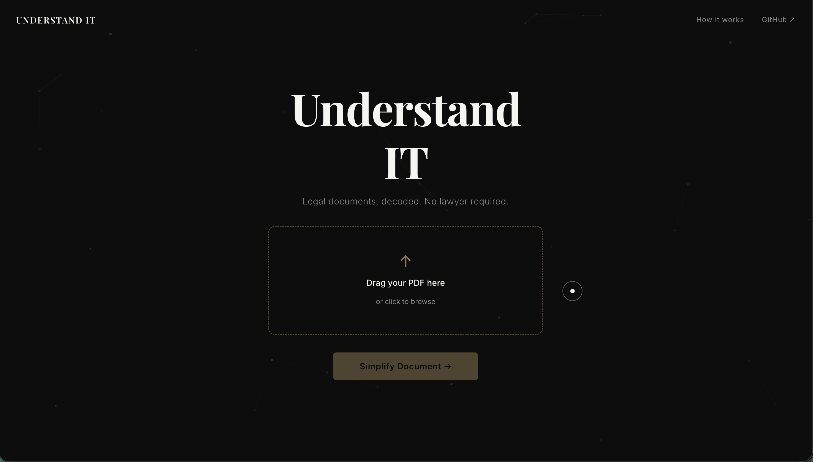
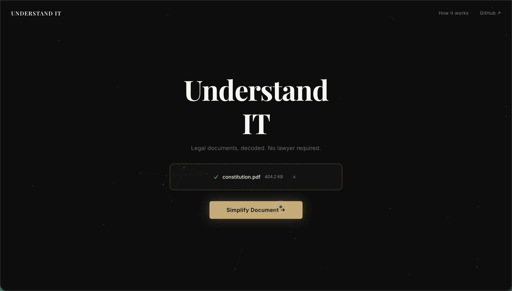
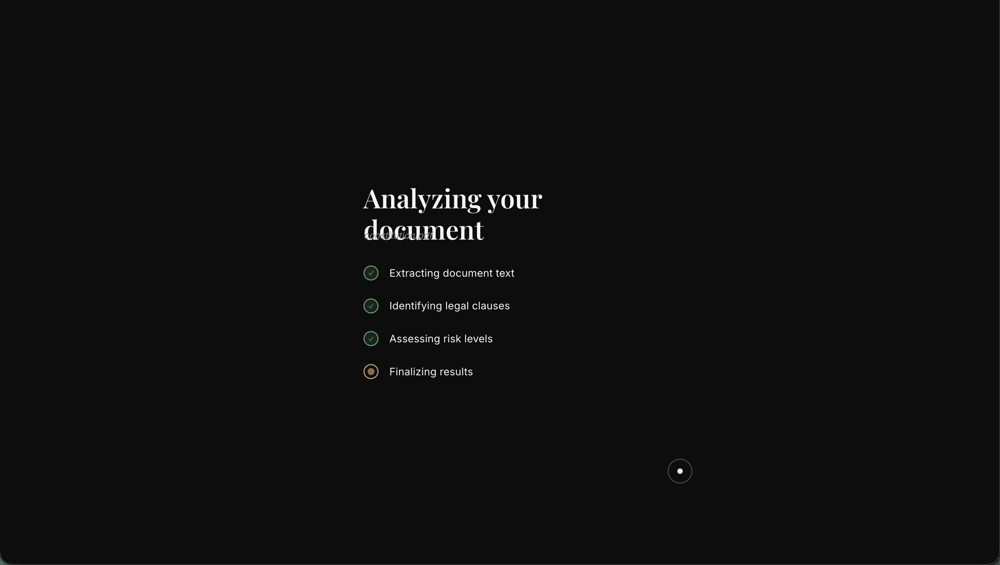
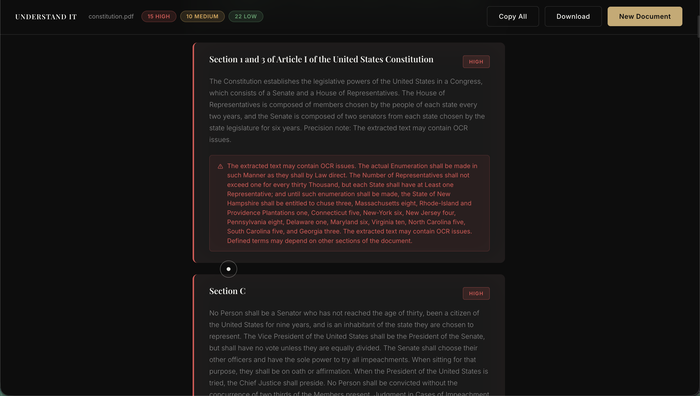
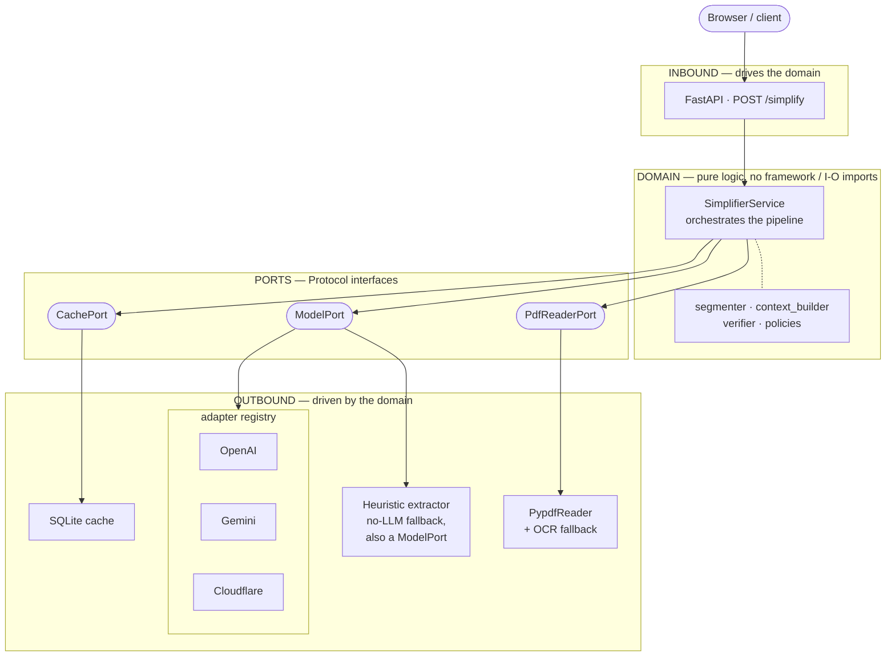
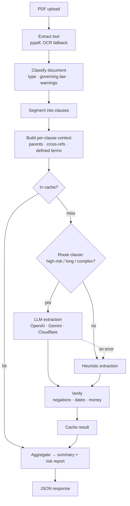

# Understand-IT

**A legal-document analyzer that turns a dense PDF contract into a plain-English, clause-by-clause breakdown — built as a strict hexagonal architecture where the domain logic never knows whether it's talking to an LLM, a regex fallback, or a mock.**



I built this for two reasons. First, legal documents waste an enormous amount of *time* — even people who can read them burn hours decoding dense clauses. Second, and more importantly, they create an *access gap*: people who can't afford a lawyer sign things they don't understand. Understand-IT does the first-pass clause-by-clause review in seconds, and it does it for anyone. It explains — it does not give legal advice.

But the app is also where I taught myself how a backend actually holds together: ports and adapters, dependency injection, graceful degradation, and a lot of things that live below the framework — how a process even gets its environment, why CORS is a browser decision and not a server one. Those notes are in [Notes from the Trenches](#notes-from-the-trenches).

---

## See it in action

Drop in a PDF, watch the pipeline run, and get every clause decoded with a risk level plus the obligations, deadlines, and money terms pulled out of it.

<p align="center">
  
  
</p>



---

## The journey

The pipeline started simple — *PDF in, plain English out* — and every real document broke a naive version of it, which is how it grew into what it is.

**Send the whole document to an LLM.** The obvious first version. It falls apart immediately: a 40-page lease blows past context limits, costs add up, and you get one undifferentiated blob back instead of clause-level risk. So the document has to be **segmented** into clauses first, by heading and section-number detection, each sized to the model's input budget.

**Send every clause to the LLM.** Better, but wasteful — most clauses are boilerplate that a regex can handle, and paying for an LLM call on "This agreement is governed by the laws of Delaware" is silly. So a **routing heuristic** decides, per clause, whether it's worth the model: high-risk clauses (indemnity, arbitration, limitation of liability), long clauses, and clauses stacked with conditionals go to the LLM; the rest go to a fast heuristic extractor.

**Trust the LLM's output.** You can't. An LLM will quietly drop a "not," a deadline, or a dollar amount and hand you fluent, confident, *wrong* plain English. So every extraction runs through a **verifier** that checks whether negations, dates, and money survived, and lowers the confidence score when they didn't. The system says when it's unsure instead of guessing silently.

**Assume the LLM is always there.** It isn't — no key, no network, rate limits. So the regex extractor doesn't just handle boilerplate; it *also implements the same interface as the LLM adapters*, so "no model available" is just another adapter to the domain, not a special case. The app degrades instead of failing.

Everything below is the architecture that fell out of those four problems.

---

## The architecture

The backend is textbook **hexagonal (ports & adapters)**. The domain — the actual legal-analysis logic — sits in the center and imports no framework, no HTTP, no LLM SDK, no database. It talks only to `Protocol` interfaces. Everything concrete plugs in at the edges.



`server.py` is the **composition root** — the only file that imports both the domain and the concrete adapters, instantiates them, and injects them into `SimplifierService`. Nothing else in the codebase knows what a `PypdfReaderAdapter` or `CloudflareAdapter` is. That single wiring point is what makes every claim above ("swap the provider without touching domain code") literally true.

### The request pipeline, top to bottom




1. **Extract** — `PypdfReaderAdapter` reads the PDF text, falling back to OCR (`tesseract` / `pdftoppm`) for scans, and tags the result with a source-quality assessment.
2. **Classify** — detect document type (NDA, lease, employment, SaaS terms, privacy policy…), governing law, and completeness warnings.
3. **Segment** — split into clauses by heading/section detection, each within the model's input budget.
4. **Build context** — resolve each clause's parent clause, cross-references ("Section 4.2"), and the defined terms it leans on.
5. **Extract per clause** — cache lookup first; on a miss, route (heuristic vs LLM per the rules above), extract into the shared `CLAUSE_SCHEMA`, and fall back to the heuristic if the model errors.
6. **Verify** — confidence check for dropped negations / dates / money.
7. **Cache** — content-addressed (SHA-256 of clause + document type) in SQLite; repeated clauses are free.
8. **Summarize** — aggregate into a document-level plain-language overview and risk report.

---

## Design decisions

### Provider config: from `if/elif` to a registry

**Problem.** Adding a model provider used to touch four places — a named field in `Settings`, an `if/elif` branch in `server.py`, a duplicate branch in the eval harness, and a model-name lookup. For a project whose whole point is *swappable providers*, that's the exact wrong shape.

**Solution.** A registry maps a provider name to its adapter class, and credentials resolve generically from the environment:

```python
ADAPTER_REGISTRY = {
    OpenAIAdapter.provider_name:     OpenAIAdapter,
    GeminiAdapter.provider_name:     GeminiAdapter,
    CloudflareAdapter.provider_name: CloudflareAdapter,
}
# build_model_adapter() reads MODEL_PROVIDER, then {PROVIDER}_API_KEY / {PROVIDER}_MODEL
```

Adding a provider is now *one adapter class + one line*. No changes to `config.py`, `server.py`, or the eval harness. And if the configured provider is missing its key or SDK, the app logs a startup warning and degrades to the heuristic — instead of booting fine and silently falling back on every clause.

**Still imperfect.** Cloudflare needs an account ID that doesn't fit the generic `{PROVIDER}_API_KEY` shape, so `CloudflareAdapter` reads `CLOUDFLARE_ACCOUNT_ID` itself — a small dent in the otherwise uniform contract.

### The heuristic is a first-class adapter, not a fallback special-case

**Problem.** "Use the LLM, but fall back to regex if it's unavailable" invites `if model_available: ... else: ...` scattered through the domain.

**Solution.** `HeuristicClauseExtractor` implements `ModelPort` (`is_available()`, `extract_clause()`) exactly like the real providers. To `SimplifierService`, the fallback is just another model. The routing and fallback logic lives in one place and reads like ordinary dispatch, not a special case.

### Structured output, one schema, three providers

All three LLM adapters emit the same `CLAUSE_SCHEMA` (JSON schema) — OpenAI via the Responses API, Cloudflare via its OpenAI-compatible Chat Completions + JSON mode, Gemini via its structured-output config. The domain receives an identical `ClauseExtraction` regardless of who produced it.

---

## Notes from the Trenches

The parts of this project I learned the most from live below the framework. Condensed from my working notes.

### Why this is actually "hexagonal"

`domain/ports.py` is the real boundary — four `Protocol`s, zero implementation. The proof is the `SimplifierService` constructor: its parameters are typed `PdfReaderPort`, `ModelPort`, `CachePort` — interfaces, never concrete classes — so the domain genuinely cannot tell whether `model` is OpenAI, Cloudflare, or a regex. **Inbound** adapters *drive* the domain (an HTTP request calls `simplify()`); **outbound** adapters are what the domain *drives* (a PDF library, an LLM, a cache). `server.py` is the one place they meet, which is the definition of dependency injection at the composition root.

### How `.env` actually reaches `os.getenv()`

When zsh runs `python3 server.py`, it does `fork()` then `execve()`. `fork()` duplicates the shell — including its environment array, which is just ordinary process memory (`char **environ`), not a kernel object. `execve()` replaces the program image but keeps that memory, so Python starts already holding a *private copy* of zsh's environment (`PATH`, `HOME`, …). `.env` sits outside all of this — it's an inert file on disk until `load_dotenv()` runs *inside* the Python process, reads it, and appends `KEY=VALUE` pairs onto that already-owned array. That's why the API keys become available only after that line, only in this one process: the disk is touched exactly once, and every later `os.getenv("CLOUDFLARE_API_KEY")` is just a memory lookup. `config.py` does those lookups once and packs them into a typed `Settings`, which is why nothing else in the app touches `os.environ`.

### CORS is a browser decision, not a server one

The easy thing to get backwards: CORS never stops your server from receiving or processing a request. The FastAPI route always runs and always sends a full response. `CORSMiddleware`'s *only* job is deciding what headers to put on that response. The gatekeeping happens later and entirely inside the browser — its networking subsystem receives the full response, checks the CORS headers against the requesting origin, and only *then* decides whether to hand the data to the JS engine running your React code. If they don't match, your `fetch()` promise rejects even though the bytes already arrived. In dev, `http://localhost:5173` (frontend) and `http://localhost:8000` (backend) are two different origins — the browser compares scheme/host/port and has no concept of "you wrote both" — which is the entire reason the middleware has to exist. Because `/simplify` is a file `POST` (a "non-simple" request), the browser also sends an automatic `OPTIONS` preflight first, which the middleware answers by echoing the allowed origin.

---

## Build & run

**Prerequisites:** Python 3.11+, Node 18+, and a model provider key. Cloudflare Workers AI has a free tier and is the default, so you can run the whole thing without paid keys.

```bash
# 1. configure — Cloudflare is the default provider
cp .env.example .env
#   set CLOUDFLARE_API_KEY and CLOUDFLARE_ACCOUNT_ID (dashboard → AI → Workers AI)

# 2. backend  (http://localhost:8000)
pip install -r backend/requirements.txt
uvicorn backend.server:app --port 8000

# 3. frontend (http://localhost:5173)
cd frontend && npm install && npm run dev
```

Open http://localhost:5173 and drop in a PDF.

**Evaluate a provider** against hand-written fixtures before trusting it — expected `clause_type`, `risk_level`, and required phrases per clause:

```bash
python -m backend.eval.run_clause_eval --provider cloudflare   # any provider in the registry
```

---

## Repo map

```
backend/
├── server.py                 composition root — wires adapters into the domain, boots FastAPI
├── config.py                 env vars → typed Settings
├── domain/                   ── the hexagon core: pure logic, no I/O imports ──
│   ├── models.py             domain nouns (Clause, ClauseExtraction, DocumentMetadata…)
│   ├── ports.py              the boundary: PdfReaderPort, ModelPort, CachePort, SimplifierPort
│   ├── simplifier.py         SimplifierService — orchestrates the pipeline via ports only
│   ├── segmenter.py          text → clause segments
│   ├── context_builder.py    parent clauses, cross-references, defined terms
│   ├── heuristics.py         regex extractor — also implements ModelPort (the fallback)
│   ├── policies.py           per-clause-type risk rules + review questions
│   └── verifier.py           post-extraction confidence check
├── adapters/
│   ├── inbound/api.py        FastAPI router: POST /simplify → SimplifierPort → JSON
│   └── outbound/             pypdf reader, provider adapters, registry, SQLite cache,
│                             structured_clause_extraction (shared CLAUSE_SCHEMA + prompt)
└── eval/                     offline scoring harness (not part of the request path)

frontend/                     React + Vite single-page app (upload → processing → results)
```

---

## Disclaimer

Understand-IT is a comprehension and accessibility tool. It helps you *understand* a document; it is **not legal advice** and is not a substitute for a qualified lawyer.
